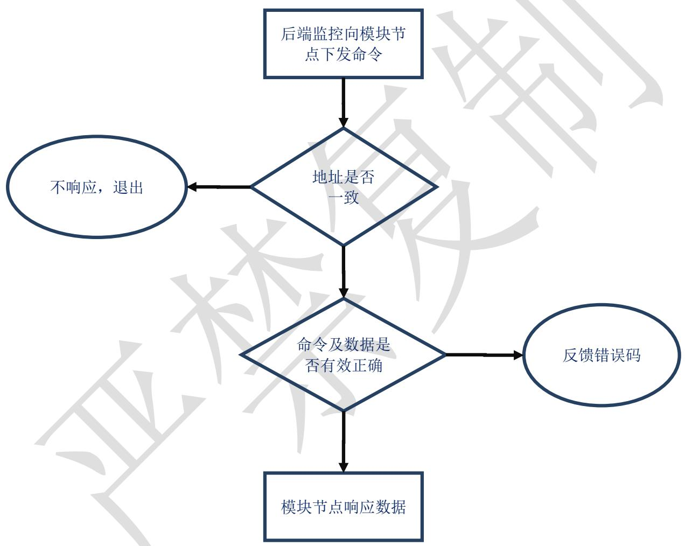

# INFYPOWER

# 英飞源技术

# 充电模块 CAN 通讯协议 V1.09

更改信息登记表  

<table><tr><td>版本</td><td>更改原因</td><td>更改说明</td><td>更改人</td><td>更改时间</td></tr><tr><td>1.00</td><td>新拟制</td><td></td><td></td><td>2015-04-24</td></tr><tr><td>1.01</td><td>修订命令</td><td></td><td></td><td>2015-05-05</td></tr><tr><td>1.02</td><td>修订注释</td><td>细化目的地址和源地址定义</td><td></td><td>2015-07-28</td></tr><tr><td>1.03</td><td>增加新命令</td><td>增加新命令,增加关键命令注释</td><td></td><td>2016-02-26</td></tr><tr><td>1.04</td><td>增加新命令</td><td>增加模块休眠命令,增加关键命令注释</td><td></td><td>2016-07-07</td></tr><tr><td>1.05</td><td>增加新命令</td><td>增加模块地址分配方式命令,增加相关注释</td><td></td><td>2016-07-19</td></tr><tr><td>1.06</td><td>增加新命令</td><td>增加单模块的调压限流命令,增加相关注释</td><td></td><td>2016-09-22</td></tr><tr><td>1.07</td><td>增加新命令</td><td>增加读取模块电压电流的定点格式命令,增加部分协议内容、增加相关注释更新错误码</td><td></td><td>2017-07-15</td></tr><tr><td>1.08</td><td>增加新命令</td><td>增加读取模块条码、外部电压、允许电流;更新0x06、0x0A、0x1C命令内容和描述;</td><td></td><td>2020-10-18</td></tr><tr><td>1.09</td><td>增加新命令</td><td>增加高低压模式、降噪模式、MPPT模式设置、出水口、入水口温度设置;增加状态表3修正描述和实例错误</td><td></td><td>2024-05-10</td></tr></table>

# 目录

# 1. 概述 3

1.1 底层协议 3  
1.2 通讯的建立  
1.3 数据类型 3

1.3.1 定点数 3  
1.3.2 浮点数 3

# 2. 应用层数据包/帧格式定义 4

2.1 帧格式 4  
2.2 帧标识符 5   
2.3 命令列表 6  
2.4 数据域详解 6

# 3. 充电机模块应用中与协议相关注意事项 14

3.1 模块开关机控制 14  
3.2 模块的软起 15  
3.3 输出电压电流设置 15   
3.4 模块地址和组号 16  
3.5 模块休眠功能 17   
3.6 CAN通讯硬件连接 17   
3.7 CAN总线数据参考 17

# 1. 概述

# 1.1 底层协议

底层协议遵循CAN2.0B。

缺省的数据传输速率为125Kbps，数据格式必须遵循CAN2.0B协议标准，CAN控制器的标志符长度29位，即支持29位标识符的扩展格式。

# 1.2 通讯的建立

# 1.3 数据类型

数据项均先传送字节高位，后传送字节低位。协议中包含定点数和浮点数。

# 1.3.1 定点数

定点数为 $1 \sim 4$ 个字节，具体的格式和发送顺序详见协议说明。

# 1.3.2 浮点数

浮点数发送顺序：浮点数的存储格式为四个字节，转换为 HEX-ASCII 码后传输，

发送时按阶码及符号位、尾数高位、尾数中位和尾数低位的先后顺序发送四个字节。浮点数采用 IEEE32 位标准浮点数格式（标准 C 语言浮点数格式），长度为 32bits，格式如下所示：

<table><tr><td>D31</td><td>D30—D23</td><td>D22—D16</td><td>D15—D8</td><td>D7—D0</td></tr><tr><td>浮点数符号S</td><td>阶码</td><td>尾数高位</td><td>尾数中位</td><td>尾数低位</td></tr></table>

若阶码为E，尾数为M，则有：浮点数值 $= \pm (1 + M\times 2^{-23})\cdot 2E^{-127}$

浮点数的正负取决于符号位S的值， $S = 1$ 表示浮点数为负， $S = 0$ 则表示浮点数为正。例如：当32位浮点数为43H，FAH，00H，00H时，即 $S = 0$ ，E=135，M=0x7A0000=61×217，则：浮点数值为 $(1 + 61 \times 2^{17} \times 2^{-23}) \cdot 2^{135 - 127} = 500$ 。

如浮点数 40.0，对应 ASCII 码：42，20，00，00，总线发送顺序为 42，20，00，00。

如浮点数 2.4，对应ascii 码：40，19，99，9A，总线发送顺序为 40，19，99，9A。

# 2. 应用层数据包/帧格式定义

# 2.1 帧格式

帧是传送信息的基本单元。CAN2.0B 帧格式如下表所示：

<table><tr><td>说明</td><td>代码</td></tr><tr><td>帧起始符</td><td>sof(1bit)</td></tr><tr><td rowspan="5">仲裁域</td><td>标识符(11bit)</td></tr><tr><td>SRR</td></tr><tr><td>IDE</td></tr><tr><td>标识符(18bit)</td></tr><tr><td>RTR</td></tr><tr><td rowspan="2">控制码</td><td>reserved(2 bits)</td></tr><tr><td>Data Len(4 bits)</td></tr><tr><td>数据域</td><td>数据(8bytes)</td></tr><tr><td>CRC域</td><td>CRC(16bits)</td></tr><tr><td>应答域</td><td>Ack(2bits)</td></tr><tr><td>结束符</td><td>(7bits)</td></tr></table>

实际用户用到的可控部分：

<table><tr><td>标识符</td><td colspan="4">数据域</td></tr><tr><td>29 位</td><td>1 字节</td><td>2 字节</td><td>……</td><td>8 字节</td></tr></table>

<table><tr><td>帧标识头</td><td>数据（1-8字节）</td></tr></table>

# 2.2 帧标识符

<table><tr><td>28</td><td>27</td><td>26</td><td>25</td><td>24</td><td>23</td><td>22</td><td>21</td><td>20</td><td>19</td><td>18</td><td>17</td><td>16</td><td>15</td><td>14</td><td>13</td><td>12</td><td>11</td><td>10</td><td>9</td><td>8</td><td>7</td><td>6</td><td>5</td><td>4</td><td>3</td><td>2</td><td>1</td><td>0</td></tr><tr><td colspan="3">错误码(3 bits)</td><td colspan="4">设备号(4 bits)</td><td colspan="6">命令号(6 bits)</td><td colspan="8">目的地址(8 bits)</td><td colspan="8">源地址(8 bits)</td></tr></table>

错误码：表示数据信息错误原因

<table><tr><td>错误码</td><td>说明</td></tr><tr><td>0x00</td><td>正常</td></tr><tr><td>0x01</td><td>/</td></tr><tr><td>0x02</td><td>命令号异常</td></tr><tr><td>0x03</td><td>数据信息异常</td></tr><tr><td></td><td></td></tr><tr><td>0x07</td><td>启动过程中</td></tr></table>

设备号：用来确定协议之间的设备定义：

<table><tr><td>设备号</td><td>说明</td></tr><tr><td>0x0A</td><td>监控与单个整流模块之间协议</td></tr><tr><td>0x0B</td><td>监控与整组整流模块之间协议</td></tr></table>

命令号：命令信息类型，详见2.3节和2.4节。

目的地址/源地址：如果目的/源地址中的模块地址为 $0 \times 3 \mathrm{~F}$ ，则表示为广播命令，除 $0 \times 01$ 、 $0 \times 02$ 和 $0 \times 08$ 命令外，广播命令只收不回送。设备号为 $0 \times 0 \mathrm{~A}$ 时，监控下发的目的地址为模块地址；设备号为 $0 \times 0 \mathrm{~B}$ 时，监控下发的目的地址为组地址。当命令号为 $0 \times 01$ 、 $0 \times 02$ 或 $0 \times 08$ ，且目的地址为广播地址(0x3F)时，模块回复信息的源地址为 $0 \times 3 \mathrm{~F}$ ，表示回复系统信息；当命令号为 $0 \times 01$ 或 $0 \times 02$ ，设备号为 $0 \times 0 \mathrm{~B}$ 时，模块回复信息的源地址为模块组号，表示回复组信息。

MPPT模块(储充系统)的地址是固定地址，范围 $0\mathrm{x}80^{\sim}0\mathrm{xDF}$ ，由 $0\mathrm{x}80+$ 拨码地址得到。如，MPPT模块拨码为2，则该模块地址是 $0\mathrm{x}82$ 。

<table><tr><td rowspan="2"></td><td colspan="8">目的/源地址</td></tr><tr><td>Bit7</td><td>Bit 6</td><td>Bit 5</td><td>Bit 4</td><td>Bit 3</td><td>Bit 2</td><td>Bit 1</td><td>Bit 0</td></tr><tr><td>模块</td><td colspan="2">保留</td><td colspan="6">模块地址00~0x3B，MPPT模块地址0x80~0xBF如果为0x3F，则表示广播命令。</td></tr><tr><td>监控</td><td colspan="8">上级监控地址为0xF0~0xF8</td></tr></table>

上级监控的地址为 $0\mathrm{xF0}\sim 0\mathrm{xF8}$ ，默认为 $0\mathrm{xF0}$ 。

整流模块地址范围为 $0\sim 0\mathrm{x}3\mathrm{B}$ ，MPPT 模块地址范围为 $0\mathrm{x}80\sim 0\mathrm{xDF}$ ； $0\mathrm{x}3\mathrm{F}$ 为广播地址，bit6,bit7 必须为 0。最多可支持 60 个模块并联。模块的地址有两种方式决定：自动分配方式（默认）和拨码方式，详见 3.4 模块地址和组号的说明。

# 2.3 命令列表

<table><tr><td>CMD</td><td></td><td colspan="8">数据信息</td></tr><tr><td>0x01</td><td>读</td><td colspan="4">系统电压(浮点数)</td><td colspan="4">系统总电流(浮点数)</td></tr><tr><td>0x02</td><td>读</td><td></td><td></td><td>模块数</td><td></td><td></td><td></td><td></td><td></td></tr><tr><td>0x03</td><td>读</td><td colspan="4">模块N电压(浮点数)</td><td colspan="4">模块N电流(浮点数)</td></tr><tr><td>0x04</td><td>读</td><td></td><td></td><td>模块组号</td><td>模块状态表3</td><td>模块环温</td><td>模块状态表2</td><td>模块状态表1</td><td>模块状态表0</td></tr><tr><td>0x06</td><td>读</td><td>VABHi*10</td><td>VABLo*10</td><td>VBCHi*10</td><td>VBCLo*10</td><td>VCAHi*10</td><td>VCALo*10</td><td></td><td></td></tr><tr><td>0x08</td><td>读</td><td colspan="4">系统总电压(mV)</td><td colspan="4">系统总电流(mA)</td></tr><tr><td>0x09</td><td>读</td><td colspan="4">模块N电压(mV)</td><td colspan="4">模块N电流(mA)</td></tr><tr><td>0x0A</td><td>读</td><td>最大电压Hi</td><td>最大电压Lo</td><td>最小电压Hi</td><td>最小电压Lo</td><td>最大电流Hi</td><td>最大电流Lo</td><td>额定功率Hi</td><td>额定功率Lo</td></tr><tr><td>0x0B</td><td>读</td><td>条码</td><td>条码</td><td>条码</td><td>条码</td><td>条码</td><td>条码</td><td>条码</td><td>条码</td></tr><tr><td>0x0C</td><td>读</td><td>外部电压Hi</td><td>外部电压Lo</td><td>允许电流Hi</td><td>允许电流Lo</td><td></td><td></td><td></td><td></td></tr><tr><td>0x0F</td><td>设</td><td>设命令Hi</td><td>设命令Lo</td><td></td><td></td><td>内容</td><td>内容</td><td>内容</td><td>内容</td></tr><tr><td>0x13</td><td>设</td><td>Walkin</td><td></td><td></td><td></td><td></td><td></td><td></td><td></td></tr><tr><td>0x14</td><td>设</td><td>绿灯闪</td><td></td><td></td><td></td><td></td><td></td><td></td><td></td></tr><tr><td>0x16</td><td>设</td><td>组号</td><td></td><td></td><td></td><td></td><td></td><td></td><td></td></tr><tr><td>0x19</td><td>设</td><td>休眠</td><td></td><td></td><td></td><td></td><td></td><td></td><td></td></tr><tr><td>0x1A</td><td>设</td><td>开关机</td><td></td><td></td><td></td><td></td><td></td><td></td><td></td></tr><tr><td>0x1B</td><td>设</td><td colspan="4">模块电压(mV)</td><td colspan="4">模块总电流(mA)</td></tr><tr><td>0x1C</td><td>设</td><td colspan="4">模块电压(mV)</td><td colspan="4">模块电流(mA)</td></tr><tr><td>0x1F</td><td>设</td><td>地址方式</td><td></td><td></td><td></td><td></td><td></td><td></td><td></td></tr></table>

# 2.4 数据域详解

<table><tr><td rowspan="2">命令号</td><td rowspan="2">说明</td><td colspan="8">数据信息</td></tr><tr><td>Byte0</td><td>Byte1</td><td>Byte2</td><td>Byte3</td><td>Byte4</td><td>Byte5</td><td>Byte6</td><td>Byte7</td></tr><tr><td>0x01</td><td>读取系统电压电流</td><td colspan="8">空注:设备号为0x0A时,目的地址为广播地址;设备号为0x0B时,目标地址为组号</td></tr></table>

<table><tr><td rowspan="6">命令号</td><td rowspan="2">说明</td><td colspan="9">数据信息</td><td></td></tr><tr><td>Byte0</td><td>Byte1</td><td>Byte2</td><td>Byte3</td><td>Byte4</td><td>Byte5</td><td>Byte6</td><td>Byte7</td><td></td><td></td></tr><tr><td rowspan="2">回复</td><td colspan="4">模块输出电压(浮点数)</td><td colspan="4">所有模块总电流(浮点数)</td><td></td><td></td></tr><tr><td colspan="8">注:设备号为0x0A时,模块回复整个系统的总电流,源地址为0x3F;设备号为0x0B时,模块回复组内所有模块电流总和,源地址为组号。也可用0x08命令(定点格式)</td><td></td><td></td></tr><tr><td rowspan="2">实例</td><td colspan="8">监控发送: 02 81 3F F0 00 00 00 00 00 00 00 00 00 00 00 00 00 00 00 00 00 00 00 00 00 00 00 00 00 00 00 00 00 00 00 00 00 01 00 00 00 00 00 00 00 00 00 00 00 00 00 00 00 00 00 00 00 00 00 00 00 00 00 00 00 00 00 00 00 00 00</td><td></td><td></td></tr><tr><td>监测发送: 02 81 F0 3F 43 FA 00 00 42 48 00 00 00 00 00 00 00 00 00 00 00 00 00 00 00 00 00 00 00 00 00 00 00 00 00 00 00 00 00 00 00 00 00
500V,总电流50A
监控发送: 02 C1 01 F0 00 00 00 00 00 00 00 00 00 00 00 00 00 00 00 00 00 00 00 00 00 00 00 00 00 00 00 00 00 00 00 00 1系统信息
模块回复: 02 C1 F0 01 43 FA 00 00 40 A0 00 00 00 00 00 00 00 00 00 00 00 00 00 00 00 00 00 00 00 00 00 00 00 00 00 00 00 00 00 00 00 00 02 00 00 00 00 00 00 00 00 00 00 00 00 00 00 00 00 00 00 00 00 00 00 00 00 00 00 00 00 00 00 00 00 00</td><td colspan="8">监测发送: 02 81 F0 3F 43 FA 00 00 42 48 00 00 00 00 00 00 00 00 00 00 00 00 00 00 00 00 00 00 00 00 00 00 01 00 00 43 FA 00 00 40 A0 00 00 00 00 00 00 00 00 00 00 00 00 00 00 00 00 00 00 00 00 00 00 00 00 00 00 00 00
500V,总电流5A</td><td></td></tr><tr><td rowspan="5">0x02</td><td>读取系统模块数</td><td colspan="8">空
注:设备号为0x0A时,目的地址为广播地址;设备号为0x0B时,目标地址为组号,</td><td></td><td></td></tr><tr><td rowspan="2">回复</td><td>0</td><td>0</td><td>模块数量</td><td>0</td><td>0</td><td>0</td><td>0</td><td>0</td><td></td><td></td></tr><tr><td colspan="8">注:设备号为0x0A时,模块回复整个系统的模块数量;设备号为0x0B时,模块组内模块数量。</td><td></td><td></td></tr><tr><td rowspan="2">实例</td><td>监控发送: 02 82 3F F0 00 00 00 00 00 00 00 00 00 00 00 00 00 00 00 00 00 00 00 00 00 00 00 00 00 00 00 00 00 00 00 1答系统有7个模块
模块回复: 02 82 F0 3F 00 00 07 00 00 00 00 00 00 00 00 00 00 00 00 00 00 00 00 00 00 00 00 00 00 00 00 00 00 00 00 00 00 00 00 00</td><td></td><td></td><td></td><td></td><td></td><td></td><td></td><td></td><td></td></tr><tr><td>监测发送: 02 C2 01 F0 00 00 00 00 00 00 00 00 00 00 00 00 00 00 00 00 00 00 00 00 00 00 00 00 00 00 00 00 00 00 00 1答组1模块数量
模块回复: 02 C2 F0 01 00 03 00 00 00 00 00 00 00 00 00 00 00 00 00 00 00 00 00 00 00 00 00 00 00 00 00 00 00 00 00 00 00 00 00</td><td></td><td></td><td></td><td></td><td></td><td></td><td></td><td></td><td></td></tr><tr><td rowspan="4">0x03</td><td>读取模块N电压电流</td><td colspan="8">空
注:N体现在ID中的目标地址</td><td></td><td></td></tr><tr><td rowspan="2">回复</td><td colspan="4">模块N电压(浮点数)</td><td colspan="4">模块N电流(浮点数)</td><td></td><td></td></tr><tr><td colspan="8">注:也可用0x09命令(定点格式)</td><td></td><td></td></tr><tr><td>实例</td><td colspan="8">监控发送: 02 83 00 F0 00 00 00 00 00 00 00 00 00 00 00 00 00 00 1读取模块0信息
模块回复: 02 83 F0 00 43 FA 00 00 40 60 00 00 00---模块0回答:电压500V电流3.5A
如果地址#模块的组号是1#,用组设备号询问(该组的所有模块以模块地址号回复)
监控发送: 02 C3 01 F0 00 00 00 00 00 00 00 00 00 00 1读取组1模块信息
模块回复: 02 C3 F0 00 43 FA 00 00 40 60 00 00 00---组1的模块(地址
O)回答500V 3.5A</td><td></td><td></td></tr><tr><td rowspan="3">0x04</td><td>读取模块N状态</td><td colspan="8">空
注:N体现在ID中的目标地址</td><td></td><td></td></tr><tr><td rowspan="2">回复</td><td>0</td><td>0</td><td>模块组号</td><td>模块状态表3</td><td>模块温度1字节定点(环温)</td><td>模块状态表2</td><td>模块状态表1</td><td>模块状态表0</td><td></td><td></td></tr><tr><td colspan="8">注:最大电流单位为0.1A。模块温度为8位有符号数,显示范围-128℃--127℃。</td><td></td><td></td></tr><tr><td colspan="8" rowspan="3">命令号</td><td rowspan="2">说明</td><td colspan="9">数据信息</td></tr><tr><td>Byte0</td><td>Byte1</td><td>Byte2</td><td>Byte3</td><td>Byte4</td><td>Byte5</td><td>Byte6</td><td>Byte7</td><td colspan="2"></td></tr><tr><td>实例</td><td colspan="10">监控发送: 02 84 00 F0 00 00 00 00 00 00 00 00 00 00——读取模块0信息模块回复: 02 84 F0 00 00 00 02 00 1B 00 40 00——模块0答: 组2,27℃, walkin如果地址0#模块的组号是2#,用组设备号询问(该组的所有模块以模块地址号回复)监控发送: 02 C4 02 F0 00 00 00 00 00 00 00 00 00——读取组2模块信息模块回复: 02 C4 F0 00 00 00 02 00 1B 00 40 00——组2的模块(地址0)回答</td></tr><tr><td colspan="8" rowspan="4">0x06</td><td>读取模块N输入电压</td><td colspan="9">空N体现在ID中的目标地址</td></tr><tr><td rowspan="2">回复</td><td>交流AB电压高字节</td><td>交流AB电压低字节</td><td>交流BC电压高字节</td><td>交流BC电压低字节</td><td>交流CA电压高字节</td><td>交流CA电压低字节</td><td>0</td><td>0</td><td colspan="2"></td></tr><tr><td colspan="10">注:单位为0.1V;</td></tr><tr><td>实例</td><td colspan="10">监控发送: 02 86 00 F0 00 00 00 00 00 00 00 00——读取模块0信息模块回复: 02 86 F0 00 OF B4 OF A5 OF A0 00 00——模块0答: AB 402VBC 400.5V CA 400V如果地址0#模块的组号是2#,用组设备号询问(该组的所有模块以模块地址号回复)监控发送: 02 C6 02 F0 00 00 00 00 00 00 00 00——读取组2模块信息模块回复: 02 C6 F0 00 OF B4 OF A5 OF A0 00 00——组2的模块(地址0)回答</td></tr><tr><td colspan="8" rowspan="5">0x08</td><td>读取系统电压电流</td><td colspan="9">空注: N体现在ID中的目标地址</td></tr><tr><td rowspan="3">回复</td><td colspan="4">系统总电压(定点数,mV)</td><td colspan="6">系统总电流(定点数,mA)</td></tr><tr><td>MSB</td><td></td><td></td><td>LSB</td><td>MSB</td><td></td><td></td><td>LSB</td><td colspan="2"></td></tr><tr><td colspan="10">设备号为0x0A时,模块回复整个系统的总电流,源地址为0x3F;设备号为0x0B时,模块回复组内所有模块电流总和,源地址为组号。</td></tr><tr><td>实例</td><td colspan="10">监控发送: 02 88 3F F0 00 00 00 00 00 00 00 00——读取系统信息模块回复: 02 88 F0 3F 00 03 OD 40 00 00 13 88——模块回复系统电压200V,总电流5A监控发送: 02 C8 01 F0 00 00 00 00 00 00 00 00——读取组1系统信息模块回复: 02 C8 F0 01 00 03 OD 40 00 00 13 88——模块回复组1电压200V,总电流5A</td></tr><tr><td colspan="8" rowspan="3">0x09</td><td>读取模块N电压电流</td><td colspan="9">空注: N体现在ID中的目标地址</td></tr><tr><td rowspan="2">回复</td><td colspan="4">模块N电压(mV)</td><td colspan="6">模块N电流(mA)</td></tr><tr><td>MSB</td><td></td><td>MSB</td><td></td><td>MSB</td><td></td><td>MSB</td><td></td><td colspan="2"></td></tr><tr><td rowspan="3">命令号</td><td rowspan="2">说明</td><td colspan="8">数据信息</td><td colspan="2"></td></tr><tr><td>Byte0</td><td>Byte1</td><td>Byte2</td><td>Byte3</td><td>Byte4</td><td>Byte5</td><td>Byte6</td><td>Byte7</td><td colspan="2"></td></tr><tr><td>实例</td><td colspan="10">监控发送: 02 89 00 F0 00 00 00 00 00 00 00 00----读取0#模块电压电流信息模块回复: 02 89 F0 00 00 03 0D 40 00 00 13 88----0#模块回复电压200V, 电流5A如果地址0#模块的组号是2#,用组设备号询问(该组的所有模块以模块地址号回复)监控发送: 02 C9 02 F0 00 00 00 00 00 00 00 00----读取组2模块电压电流信息模块回复: 02 C9 F0 00 00 03 0D 40 00 00 13 88----组2的模块(地址0)回答</td></tr><tr><td rowspan="4">0x0A</td><td>读取模块N信息</td><td colspan="8">空注:N体现在ID中的目标地址</td><td colspan="2"></td></tr><tr><td rowspan="2">回复</td><td>VomaxHi</td><td>VomaxLo</td><td>VominHi</td><td>VominLo</td><td>IomaxHi</td><td>IomaxLo</td><td>PrateHi</td><td>PrateLo</td><td colspan="2"></td></tr><tr><td colspan="8">注:电压回复值单位为V,电流回复值单位为0.1A,功率回复值单位为10W</td><td colspan="2"></td></tr><tr><td>实例</td><td colspan="8">监控发送: 02 8A 00 F0 00 00 00 00 00 00 00 00----读取0#模块电压电流限值信息模块回复: 02 8A F0 00 02 EE 00 64 01 00 05 DC----0#模块回复750V, 100V, 25.6A, 15KW如果地址0#模块的组号是2#,用组设备号询问(该组的所有模块以模块地址号回复)监控发送: 02 CA 02 F0 00 00 00 00 00 00 00----读取组2模块电压电流信息模块回复: 02 CA F0 00 02 EE 00 64 01 00 05 DC----组2的模块(地址0)回答750V, 100V, 25.6A, 15KW</td><td colspan="2"></td></tr><tr><td rowspan="3">0x0B</td><td>读取模块N信息</td><td colspan="8">空注:N体现在ID中的目标地址举例,读条码XXXXXXXXXXXXV001A00</td><td colspan="2"></td></tr><tr><td>回复</td><td>Bit 13(ACSII)</td><td colspan="5">条码中的12bitsXXXXXXXXXXXX (HEX)</td><td colspan="2">Bit 14~17YYYY (HEX)</td><td colspan="2"></td></tr><tr><td>实例</td><td colspan="8">监控发送: 02 8B 00 F0 00 00 00 00 00 00 00:读取0#模块条码信息模块回复: 02 8B F0 00 56 13 0C15 A3 FB 06 A8:0#模块回答081807123451V1704</td><td colspan="2"></td></tr><tr><td rowspan="4">0x0C</td><td>读取模块N信息</td><td colspan="8">空注:N体现在ID中的目标地址</td><td colspan="2"></td></tr><tr><td rowspan="2">回复</td><td>外部电压Hi</td><td>外部电压Lo</td><td>允许电流Hi</td><td>允许电流Lo</td><td></td><td></td><td></td><td></td><td colspan="2"></td></tr><tr><td colspan="8">注:电压单位0.1V,电流单位0.1A。允许电流是当前工况下的最大允许输出电流。</td><td colspan="2"></td></tr><tr><td>实例</td><td colspan="8">监控发送: 02 8C 00 F0 00 00 00 00 00 00 00:读取0#模块信息模块回复: 02 8C F0 00 13 58 01 66 00 00 00 00:0#模块回答外部电压495.2V允许电流35.8A注:当模块处于关机状态,模块的允许电流为0。</td><td colspan="2"></td></tr><tr><td></td><td></td><td colspan="8"></td><td colspan="2"></td></tr><tr><td></td><td></td><td colspan="8"></td><td colspan="2"></td></tr></table>

<table><tr><td rowspan="2">命令号</td><td rowspan="2">说明</td><td colspan="8">数据信息</td></tr><tr><td>Byte0</td><td>Byte1</td><td>Byte2</td><td>Byte3</td><td>Byte4</td><td>Byte5</td><td>Byte6</td><td>Byte7</td></tr><tr><td rowspan="14">0xOF</td><td rowspan="2">设置综合命令</td><td>MsgHi</td><td>MsgLo</td><td></td><td></td><td></td><td></td><td></td><td></td></tr><tr><td colspan="8">注: N 体现在 ID 中的目标地址。广播命令无应答</td></tr><tr><td rowspan="3">设置CEG工作模式(部分型号支持)</td><td>0x11</td><td>0x11</td><td>0/1</td><td>0</td><td>0</td><td>0</td><td>0</td><td>A0~A2</td></tr><tr><td colspan="8">0/1: Byte2 为 1 时, 查询该设置0xA0: DCDC; 0xA1: MPPT; 0xA2: 输入恒压模式工作模式, 支持广播/组/单模块设置, 仅允许模块处于待机时设置, 掉电保存:</td></tr><tr><td colspan="8">监控发送: 02 8F 3F F0 11 11 00 00 00 00 00 A1——广播设置工作于 MPPT模式模块无回复监控发送: 02 8F 01 F0 11 11 01 00 00 00 00 00——查询模块 1 工作模式模块回复: 02 8F F0 01 11 11 01 00 00 00 00 A1——模块 1 处于 MPPT 工作模式</td></tr><tr><td rowspan="3">设置噪音模式(部分型号支持)</td><td>0x11</td><td>0x13</td><td>0</td><td>0</td><td>0</td><td>0</td><td>0</td><td>A0~A2</td></tr><tr><td colspan="8">0xA0: 功率优先; 0xA1: 降噪模式; 0xA2: 静音模式;</td></tr><tr><td colspan="8">监控发送: 02 8F 3F F0 11 13 00 00 00 00 00 A1——广播设置工作于降噪模式</td></tr><tr><td rowspan="3">设置高低压模式(部分型号支持)</td><td>0x11</td><td>0x14</td><td>0</td><td>0</td><td>0</td><td>0</td><td>0</td><td>A0~A2</td></tr><tr><td colspan="8">0xA0: 低压模式; 0xA1: 高压模式; 0xA2: 模块自动控制切换;注: 1、仅 04 读取模块状态命令模块状态表 3 高低压状态非 0 的模块支持2、仅允许模块处于待机时设置</td></tr><tr><td colspan="8">监控发送: 02 8F 3F F0 11 14 00 00 00 00 00 A1——广播设置工作于高压模式</td></tr><tr><td rowspan="3">设置温度(液冷模块支持)</td><td>0x13</td><td>0x01</td><td>0</td><td>0</td><td>0</td><td>TIN (°C)</td><td>TOUT (°C)</td><td>TAMB (°C)</td></tr><tr><td colspan="8">注:有符号数[-40, 125], TIN、TOUT、TAMB 为监控下发的进水口温度、出水口温度、环温</td></tr><tr><td colspan="8">监控发送: 02 8F 3F F0 13 01 00 00 00 2A 2D 24——广播下发进水口温度 42°C, 出水口温度 45°C, 环温 36°C</td></tr><tr><td></td><td></td><td></td><td></td><td></td><td></td><td></td><td></td><td></td><td></td></tr><tr><td></td><td></td><td></td><td></td><td></td><td></td><td></td><td></td><td></td><td></td></tr><tr><td rowspan="3">0x13</td><td rowspan="2">设置模块N WALK使能禁止</td><td>Walk-In使能</td><td>0</td><td>0</td><td>0</td><td>0</td><td>0</td><td>0</td><td>0</td></tr><tr><td colspan="8">注:1 为使能,0 为禁止。N 体现在 ID 中的目标地址</td></tr><tr><td>回复</td><td colspan="8">广播命令无回复,点对点命令有回复,组命令该组所有模块回复,回复值为当前生效值</td></tr></table>

<table><tr><td rowspan="3">命令号</td><td rowspan="2">说明</td><td colspan="8">数据信息</td><td></td></tr><tr><td>Byte0</td><td>Byte1</td><td>Byte2</td><td>Byte3</td><td>Byte4</td><td>Byte5</td><td>Byte6</td><td>Byte7</td><td></td></tr><tr><td>实例</td><td colspan="9">监控发送: 02 93 3F F0 01 00 00 00 00 00 00 00 00----设置所有模块walkin使能模块回复: 广播无回复监控发送: 02 93 00 F0 00 00 00 00 00 00 00 00 00----设置0#模块walkin不使能模块回复: 02 93 F0 00 00 00 00 00 00 00 00 00 00----0#模块回复当前设定walkin不使能如果地址0#模块的组号是2#,用组设备号设置(该组的所有模块以模块地址号回复)监控发送: 02 D3 02 F0 01 00 00 00 00 00 00 00----设置组2模块Cwalkin使能模块回复: 02 D3 F0 00 01 00 00 00 00 00 00 00----组2的模块(地址0)当前设定使能</td></tr><tr><td rowspan="4">0x14</td><td rowspan="2">设置模块N绿灯闪烁</td><td>模块绿灯闪烁</td><td>0</td><td>0</td><td>0</td><td>0</td><td>0</td><td>0</td><td>0</td><td></td></tr><tr><td colspan="8">注:1为闪烁,0为正常。N体现在ID中的目标地址</td><td></td></tr><tr><td>回复</td><td colspan="8">广播命令无回复,点对点命令有回复,组命令该组所有模块回复,回复值为当前生效值</td><td></td></tr><tr><td>实例</td><td colspan="8">监控发送: 02 94 3F F0 01 00 00 00 00 00 00 00----设置所有模块绿灯闪模块回复: 广播无回复监控发送: 02 94 00 F0 00 00 00 00 00 00 00----设置0#模块绿灯不闪模块回复: 02 94 F0 00 00 00 00 00 00 00 00----0#模块回复当前不闪如果地址0#模块的组号是2#,用组设备号设置(该组的所有模块以模块地址号回复)监控发送: 02 D4 02 F0 01 00 00 00 00 00 00----设置组2模块绿灯闪模块回复: 02 D4 F0 00 01 00 00 00 00 00 00----组2的模块(地址0)当前设定闪</td><td></td></tr><tr><td rowspan="3">0x16</td><td rowspan="2">设置模块N组号</td><td>模块组号</td><td>0</td><td>0</td><td>0</td><td>0</td><td>0</td><td>0</td><td>0</td><td></td></tr><tr><td colspan="8">注:组号从1开始。N体现在ID中的目标地址支持组控制的模块适用此命令如果分组设置有改变,请在分组设置4s后再下发0x1B总电流命令!</td><td></td></tr><tr><td>回复</td><td colspan="8">广播命令无回复,点对点命令有回复,组命令该组所有模块回复,回复值为当前生效值</td><td></td></tr><tr><td>实例</td><td colspan="9">监控发送: 02 96 3F F0 02 00 00 00 00 00 00 00----设置所有模块为组2模块回复: 广播无回复监控发送: 02 96 00 F0 03 00 00 00 00 00 00 00----设置0#模块为组3模块回复: 02 96 F0 00 03 00 00 00 00 00 00 00----0#模块回复当前组号为3如果地址0#模块当前组号是2#,用组设备号设置(该组的所有模块以模块地址号回复)监控发送: 02 D6 02 F0 05 00 00 00 00 00 00 00----设置组2模块组号为5模块回复: 02 D6 F0 00 05 00 00 00 00 00 00 00----组2的模块(地址0)当前组号为5</td></tr><tr><td rowspan="4">0x19</td><td rowspan="2">设置模块N休眠</td><td>模块休眠</td><td>0</td><td>0</td><td>0</td><td>0</td><td>0</td><td>0</td><td>0</td><td></td></tr><tr><td colspan="8">1: 模块休眠; 0: 模块不休眠</td><td></td></tr><tr><td>回复</td><td colspan="8">广播命令无回复,点对点命令有回复,组命令该组所有模块回复,回复值为当前生效值</td><td></td></tr><tr><td>实例</td><td colspan="8">监控发送: 02 99 3F F0 01 00 00 00 00 00 00----设置所有模块休眠模块回复: 广播无回复监控发送: 02 99 00 F0 00 00 00 00 00 00 00----设置0#模块无休眠模块回复: 02 99 F0 00 00 00 00 00 00 00 00----0#模块回复当前设定如果地址0#模块的组号是2#,用组设备号设置(该组的所有模块以模块地址号回复)监控发送: 02 D9 02 F0 01 00 00 00 00 00 00----设置组2模块休眠模块回复: 02 D9 F0 00 01 00 00 00 00 00 00----组2的模块(地址0)当前设定</td><td></td></tr><tr><td rowspan="4">0x1A</td><td rowspan="2">控制所有模块开关机</td><td>开关机</td><td>0</td><td>0</td><td>0</td><td>0</td><td>0</td><td>0</td><td>0</td><td></td></tr><tr><td colspan="8">1为关机,0为开机注:该命令为广播命令,无回复。设备号为0xA时,命令中目标地址的模块地址为3F;设备号为0xB时,目标地址为相应的组号。</td><td></td></tr><tr><td>回复</td><td colspan="8">广播命令无回复,点对点命令有回复,组命令该组所有模块回复,回复值为当前生效值</td><td></td></tr><tr><td>实例</td><td colspan="8">监控发送: 02 9A 3F F0 01 00 00 00 00 00 00----设置所有模块关机模块回复: 广播无回复监控发送: 02 9A 00 F0 00 00 00 00 00 00 00----设置0#模块开机模块回复: 02 9A F0 00 00 00 00 00 00 00----0#模块回复当前为开机如果地址0#模块的组号是2#,用组设备号设置(该组的所有模块以模块地址号回复)监控发送: 02 DA 02 F0 01 00 00 00 00 00 00----设置组2模块关机模块回复: 02 DA F0 00 01 00 00 00 00 00 00----组2的模块(地址0)当前设定</td><td></td></tr><tr><td>0x1B</td><td>设置输</td><td colspan="4">电压(mV)</td><td colspan="4">总电流(mA)</td><td></td></tr></table>

<table><tr><td rowspan="6">命令号</td><td rowspan="4">说明出电压输出总电流</td><td colspan="8">数据信息</td></tr><tr><td>Byte0</td><td>Byte1</td><td>Byte2</td><td>Byte3</td><td>Byte4</td><td>Byte5</td><td>Byte6</td><td>Byte7</td></tr><tr><td>MSB</td><td></td><td></td><td>LSB</td><td>MSB</td><td></td><td></td><td>LSB</td></tr><tr><td colspan="8">注:设备号为0x0A时,命令中目标地址的模块地址为3F;设备号为0x0B时,命令中目标地址为组号。电压单位为mV;总电流单3位为mA,为设定的所有模块的输出电流之和。如果分组设置有改变,请在分组设置4s以后再下发该命令!</td></tr><tr><td>回复</td><td colspan="8">广播命令主模块回复,源地址为3F,点对点命令有回复,组命令该组主模块回复,源地址为组号,回复数据为当前设定值</td></tr><tr><td>实例</td><td colspan="8">监控发送: 02 9B 3F F0 00 04 93 E0 00 00 27 10-设置所有模块电压300V,总电流10A模块回复: 02 9B F0 3F 00 04 93 C9 00 00 27 10-主模块回复300V,总电流10A如果地址0#模块的组号是2#,用组设备号设置(该组的主模块以组号回复)监控发送: 02 DB 02 F0 00 03 0D 40 00 00 13 88-设置组2模块电压200V 总电流5A模块回复: 02 DB F0 02 00 03 0D 40 00 00 13 88-组2主模块回复当前电压和总电流设定</td></tr><tr><td rowspan="5">0x1C</td><td rowspan="3">设置输出电压输出电流</td><td colspan="4">电压(mV)</td><td colspan="4">电流(mA)</td></tr><tr><td>MSB</td><td></td><td></td><td>LSB</td><td>MSB</td><td></td><td></td><td>LSB</td></tr><tr><td colspan="8">注:设备号为0x0A时,命令中目标地址的模块地址为3F表示广播命令,所有模块接收,广播无回复;命令中目标地址为单模块地址时表示点对点命令,对应模块接收,对应模块回复;设备号为0x0B时,命令中目标地址为组号。电压单位为mV;电流单位为mA。</td></tr><tr><td>回复</td><td colspan="8">广播命令无回复,点对点命令有回复,组命令该组所有模块回复,回复值为当前生效值</td></tr><tr><td>实例</td><td colspan="8">监控发送: 02 9C 3F F0 00 04 93 E0 00 00 27 10-设置所有模块电压300V,电流10A模块回复: 广播无回复监控发送: 02 9C 00 F0 00 03 0D 40 00 00 13 88-设置0#模块电压200V 电流5A模块回复: 02 9C F0 00 00 03 0D 31 00 00 13 88-0#模块回复当前电压电流设定如果地址0#模块的组号是2#,用组设备号设置(该组的所有模块以模块地址号回复)监控发送: 02 DC 02 F0 00 03 0D 40 00 00 13 88-设置组2模块电压200V 电流5A模块回复: 02 DC F0 00 00 03 0D 40 00 00 13 88-组2的模块(地址0)回复当前设定</td></tr><tr><td rowspan="2">0x1F</td><td rowspan="2">设置模块地址分配方式</td><td>地址方式</td><td>0</td><td>0</td><td>0</td><td>0</td><td>0</td><td>0</td><td>0</td></tr><tr><td colspan="8">1为地址拨码方式,0为地址自动分配方式注:1、该命令为广播命令,无回复。设备号为0x0A,命令中目标地址的模块地址为3F;支持拨码设置地址的模块适用此命令2、因为拨码默认为组号,因此当使用0x1F协议设置为地址拨码方式时,需对模块的组号进行设置(命令号0x16)和确认(命令号0x04)</td></tr></table>

<table><tr><td rowspan="4">命令号</td><td rowspan="2">说明</td><td colspan="9">数据信息</td></tr><tr><td>Byte0</td><td>Byte1</td><td>Byte2</td><td>Byte3</td><td>Byte4</td><td>Byte5</td><td>Byte6</td><td>Byte7</td><td></td></tr><tr><td>回复</td><td colspan="9">广播命令无回复,点对点命令有回复,组命令该组所有模块回复,回复值为当前生效值</td></tr><tr><td>实例</td><td colspan="9">监控发送: 02 9F 3F F0 01 00 00 00 00 00 00 00 00——设置所有模块的地址为拨码方式模块回复: 广播无回复监控发送: 02 9F 00 F0 00 00 00 00 00 00 00 00——设置0#模块的地址为自动分配方式模块回复: 02 9F F0 00 00 00 00 00 00 00 00 00——0#模块回复当前设定如果地址0#模块的组号是2#,用组设备号设置(该组的所有模块以模块地址号回复)监控发送: 02 DF 02 F0 00 00 00 00 00 00 00——设置组2模块地址为自动分配方式模块回复: 02 DF F0 00 00 00 00 00 00 00 00——组2的模块(地址0)当前设定</td></tr></table>

<table><tr><td></td><td>模块N状态表3</td><td>模块N状态表2</td><td>模块N状态表1</td><td>模块N状态表0</td></tr><tr><td>Bit7</td><td></td><td>1: 模块PFC侧处于关机状态</td><td>1: 模块通信中断告警</td><td></td></tr><tr><td>Bit6</td><td></td><td>1: 输入过压告警</td><td>1: WALK-IN使能</td><td>1: 风道不畅</td></tr><tr><td>Bit5</td><td></td><td>1: 输入欠压告警</td><td>1: 输出过压告警</td><td>1: 模块放电异常</td></tr><tr><td>Bit4</td><td></td><td>1: 三相输入不平衡告警</td><td>1: 过温告警</td><td>1: 模块休眠</td></tr><tr><td>Bit3</td><td></td><td>1: 三相输入缺相告警</td><td>1: 风扇故障告警</td><td>1: 输入或母线异常</td></tr><tr><td>Bit2</td><td></td><td>1: 模块严重不均流</td><td>1: 模块保护告警</td><td>1: 模块内部通信故障</td></tr><tr><td rowspan="4">Bit1</td><td>00: 模块不需高低压控制</td><td rowspan="2">1: 模块ID重复</td><td rowspan="2">1: 模块故障告警</td><td rowspan="2"></td></tr><tr><td>01: 高低压自动控制模式</td></tr><tr><td>10: 监控设定的低压模式</td><td rowspan="2">1: 模块处于限功率状态</td><td rowspan="2">1: 模块DC侧处于关机状态</td><td rowspan="2">1: 输出短路</td></tr><tr><td>11: 监控设定的高压模式</td></tr></table>

注：针对某个组的命令，设备号用0x0B，目标地址为组号。当目标地址为3F时，表示针对所有组，如紧急情况下的关闭所有模块。读取命令只支持0x01/0x08和0x02，设置命令只支持0x1A和0x1B。

注：以 0x0757F8XX 为帧头的报文为模块之间的信息传送,上级监控单元可忽略。

# 3. 充电机模块应用中与协议相关注意事项

# 3.1 模块开关机控制

监控下发模块开机命令后，需要与模块保持通讯（下发设置命令或查询命令均可以），当模块持续一段时间（默认为10s）没有接收到监控命令后，模块会报通讯中断，同时

关机。如果通讯中断前模块处开机状态，模块通讯恢复后会自动开机，输出通讯中断前的电压、电流；如果通讯中断前模块处关机状态，通讯恢复后仍保持关机，监控下发开机命令才会开机。

# 3.2 模块的软起

模块的 walk-in 功能即为输出电流软起功能，出厂默认使能软起功能，默认软起时间为 5s，指的是输出电流由 0 上升到额定电流的时间。监控也可以通过将输出电流给定值慢慢放开的方式自己控制软起。

推荐的开机时序：上电一设置好模块的输出电压、电流--吸合系统输出继电器一模块开机

推荐的关机时序：模块关机--断开输出继电器

# 3.3 输出电压电流设置

不同的模块输出电压、电流的可设置范围不同，超出范围的设置值将不会被模块接收，此时下发开机命令后模块将按上次的设置值输出（如果模块上电后未设置过输出电压电流，将按默认值输出），不同类型的模块输出电压、电流可设置范围及默认输出值如下表所示。需设要注意的是当系统中有模块出现模块保护告警或模块故障告警时（可通过命令号0x04读取模块状态位），该模块不能开机，因此不会均分设定的系统或组电流。例如系统中有6个REG75020，假设有一个模块报模块故障告警，监控通过0x1B命令下发输出电流90A，由于 $90\mathrm{A} / 5 = 18\mathrm{A}$ ，大于模块电流设置上限，因此模块不会接收。而模块都正常时，下发90A电流，每个模块会输出 $90 / 6 = 15\mathrm{A}$ ，可以接收和响应。

<table><tr><td>模块型号</td><td>输出电压设置范围</td><td>输出电流设置范围</td><td>额定电流</td><td>默认设置</td><td>默认变更</td></tr><tr><td>REG85750</td><td>100V-750V</td><td>0.1A-15A</td><td>10A</td><td>600V, 15A</td><td></td></tr><tr><td>REG85500</td><td>100V-550V</td><td>0.12A-20A</td><td>13.64A</td><td>500V, 20A</td><td></td></tr><tr><td>REG75020</td><td>100V-750V</td><td>0.13A-16.7A</td><td>13A</td><td>600V, 16.7A</td><td>100V, 2.6A</td></tr><tr><td>REG50025</td><td>100V-550V</td><td>0.2A-23A</td><td>20A</td><td>500V, 23A</td><td>100V, 4A</td></tr><tr><td>REG75030</td><td>100V-750V</td><td>0.2A-25.7A</td><td>20A</td><td></td><td>100V, 4A</td></tr><tr><td>REG50040</td><td>100V-550V</td><td>0.3A-35A</td><td>30A</td><td></td><td>100V, 6A</td></tr><tr><td>REG75035</td><td>50V-750V</td><td>0.26A-33A</td><td>26A</td><td></td><td>100V, 5.2A</td></tr><tr><td>REG50050</td><td>50V-550V</td><td>0.4A-50A</td><td>40A</td><td></td><td>100V, 8A</td></tr></table>

注：从时间上支持 1.07 版本协议的充电模块，当下发输出电流大于模块电流设置上限时，按上限值输出。例如系统中有 5 个 REG75030，假设有一个模块报模块故障告

警，监控通过 0x1B 命令下发输出电流 120A，120A/4=30A，大于模块电流设置上限，则 4 个开机模块按最大能力 25.7A 输出。而模块都正常时，下发 120A 电流，每个模块会输出 $120 / 5 = 24 \mathrm{~A}$ ，可以接收和响应。

2017年2月以后的REG75030和REG50040模块的最低输出电压支持到 $50\mathrm{V}$ 。

为适应不同的控制方式，增加1C命令来控制系统所有模块或组内所有模块或单模块的电压电流。上级设备根据需要正确选择使用总电流值命令下发或电流值命令下发。

# 3.4 模块地址和组号

模块的地址有两种方式获得：

# 1、自动分配方式（默认方式）：

模块上电后会自动分配地址，这个地址是按照模块内部的出厂序列号来分配的，所以只要不更换模块、插入新模块或拔出模块，每次上电后模块的地址都一样。模块的组号是通过面板上的拨码开关来设置的，出厂时拨码开关全为0，因此所有模块的分组都默认为组0。对于没有拨码开关的模块，可以通过命令号0x16设置模块组号，但是设置的组号没有保存到EEPROM，因此每次上电都要重设。

由于模块地址是自动分配，组地址可人工设置，查询组内的模块地址可通过如下方法：初次上电待模块地址分配完成后（约10s后），监控下发命令”0284xxF0000000000000000”轮询模块状态(其中xx为模块地址)，查询模块所属的组号。确定好组内模块地址后，如果没更换模块和拨码设置，后续上电无须再进行组号一地址匹配。

# 2、拨码方式（限支持拨码功能的模块有效）

REG75020 模块软件版本 1.20 以上版本或者 REG50025 模块软件版本 2.20 以上版本具有拨码方式。

REG75030和REG50040模块具有拨码方式。

模块的地址由面板上的拨码产生，所以更换模块、插入新模块，需要操作拨码，设置为需要的地址，出厂时拨码开关全为0，因此在拨码方式下地址默认为0。模块的组号是通过命令号0x16设置模块组号，但是设置的组号没有保存到EEPROM，因此每次上电都要重设。在用0x1F命令设置地址为拨码方式后，需要设置和确认模块的组号是否符合。

查询组内的模块地址可通过如下方法：初次上电待模块地址分配完成后(约10s后)，

监控下发命令”02 84 xx F0 00 00 00 00 00 00 00 00 00”轮询模块状态(其中xx为模块地址)，查询模块所属的组号。确定好组内模块地址后，如果没更换模块和拨码设置，后续上电无须再进行组号一地址匹配。

当系统上的的模块地址有冲突，地址冲突的模块会点红灯，上报地址冲突故障，当移除冲突的地址后可恢复正常。

# 3.5 模块休眠功能

REG75020模块软件版本1.06以上或者REG50025模块软件版本2.06以上，REG75030和REG50040模块具有休眠功能。休眠功能主要用于系统负载较小时，可提高系统转换效率，用命令号0x19可设置或取消模块休眠。设置为休眠态的模块会处于待机状态，不能开机，监控下发系统电流或组电流命令时，休眠的也不会被分配电流，因此需要在下发限流命令前设置好模块休眠。例如系统中有6个REG75020，地址分别为 $0\sim 5$ ，系统需要输出40A，监控想让地址0和1两个模块休眠，4个模块开机，需要先下发命令”029900F0010000000000000”和”029901F001000000000000”设置0和1两个模块休眠，再通过0x1B命令设置系统输出电流为40A，最后通过0x1A命令模块开机。这样模块0和1将不会开机，模块 $2\sim 5$ 会开机，每个模块输出10A，总电流40A。

# 3.6 CAN通讯

系统CAN通讯硬件连接线为双绞线总线式接线，需要注意不能与功率线混在一起，而应分开走线，否则容易受干扰。此外，CAN总线上必须接终端匹配电阻，阻值 $75\Omega \sim 150$ $\Omega$ ，建议 $120\Omega$ 。

监控发送指令到模块的间隔时间建议为 $50 \sim 200 \mathrm{~ms}$ , 需大于 $20 \mathrm{~ms}$ 。

# 3.7 CAN总线数据参考

以下CAN数据为供参考，系统3个模块为例：

<table><tr><td>方向</td><td>ID</td><td>DATA</td><td>说明</td></tr><tr><td>模块接收</td><td>02 9A 3F F0</td><td>01 00 00 00 00 00 00 00</td><td>所有模块关机</td></tr><tr><td>模块接收</td><td>02 9C 3F F0</td><td>00 0B 71 B0 00 00 3A 98</td><td>所有模块都输出750V 15A</td></tr><tr><td>模块接收</td><td>02 9A 3F F0</td><td>00 00 00 00 00 00 00 00</td><td>所有模块开机,充电开始</td></tr><tr><td>模块接收</td><td>02 89 00 F0</td><td>00 00 00 00 00 00 00 00</td><td></td></tr><tr><td>模块发送</td><td>02 89 F0 00</td><td>00 0B 6F BC 00 00 3A 98</td><td>模块0输出749.5V 15A</td></tr><tr><td>模块接收</td><td>02 89 01 F0</td><td>00 00 00 00 00 00 00 00</td><td></td></tr><tr><td>模块发送</td><td>02 89 F0 01</td><td>00 0B 71 B0 00 00 3A 98</td><td>模块1输出750V 15A</td></tr><tr><td>模块接收</td><td>02 89 02 F0</td><td>00 00 00 00 00 00 00 00</td><td></td></tr><tr><td>模块发送</td><td>02 89 F0 02</td><td>00 0B 71 B0 00 00 3A 98</td><td>模块2输出750V 15A</td></tr><tr><td>模块接收</td><td>02 84 00 F0</td><td>00 00 00 00 00 00 00 00</td><td></td></tr><tr><td>模块发送</td><td>02 84 F0 00</td><td>00 00 02 00 16 00 40 00</td><td>模块0组号为2,22℃, walk使能</td></tr><tr><td>模块接收</td><td>02 84 01 F0</td><td>00 00 00 00 00 00 00 00</td><td></td></tr><tr><td>模块发送</td><td>02 84 F0 01</td><td>00 00 02 00 18 00 40 00</td><td>模块1组号为2,24℃, walk使能</td></tr><tr><td>模块接收</td><td>02 84 02 F0</td><td>00 00 00 00 00 00 00 00</td><td></td></tr><tr><td>模块发送</td><td>02 84 F0 02</td><td>00 00 02 00 17 00 40 00</td><td>模块2组号为2,23℃, walk使能</td></tr><tr><td>模块接收</td><td>02 9C 3F F0</td><td>00 0B 71 B0 00 00 3A98</td><td>所有模块都输出750V 15A</td></tr><tr><td>模块接收</td><td>02 9A 3F F0</td><td>00 00 00 00 00 00 00 00</td><td>所有模块开机</td></tr><tr><td>模块接收</td><td>02 89 00 F0</td><td>00 00 00 00 00 00 00 00</td><td></td></tr><tr><td>模块发送</td><td>02 89 F0 00</td><td>00 0B 6F BC 00 00 3A 98</td><td>模块0输出749.5V 15A</td></tr><tr><td>模块接收</td><td>02 89 01 F0</td><td>00 00 00 00 00 00 00 00</td><td></td></tr><tr><td>模块发送</td><td>02 89 F0 01</td><td>00 0B 71 B0 00 00 3A 98</td><td>模块1输出750V 15A</td></tr><tr><td>模块接收</td><td>02 89 02 F0</td><td>00 00 00 00 00 00 00</td><td></td></tr><tr><td>模块发送</td><td>02 89 F0 02</td><td>00 0B 71 B0 00 00 3A 98</td><td>模块2输出750V 15A</td></tr><tr><td>模块接收</td><td>02 84 00 F0</td><td>00 00 00 016 00 40 00</td><td></td></tr><tr><td>模块发送</td><td>02 84 F0 00</td><td>00 00 02 00 16 00 40 00</td><td>模块0组号为2,22℃, walk使能</td></tr><tr><td>模块接收</td><td>02 84 01 F0</td><td>00 00 00 00 00 00 00 0</td><td></td></tr><tr><td>模块发送</td><td>02 84 F0 01</td><td>00 00 02 00 18 00 40 00</td><td>模块1组号为2,24℃, walk使能</td></tr><tr><td>模块接收</td><td>02 84 02 F0</td><td>00 00 00 00 00 00 00 00</td><td></td></tr></table>